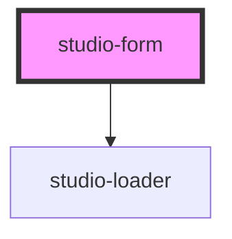

# studio-form

<!-- Auto Generated Below -->

## Properties

| Property    | Attribute    | Description             | Type      | Default     |
| ----------- | ------------ | ----------------------- | --------- | ----------- |
| `isLoading` | `is-loading` | Indicates loading state | `boolean` | `undefined` |

## Events

| Event           | Description | Type               |
| --------------- | ----------- | ------------------ |
| `formSubmitted` |             | `CustomEvent<any>` |

## Dependencies

### Depends on

- [studio-loader](../studio-loader)

### Graph

----------------------------------------------

*Built with [StencilJS](https://stenciljs.com/)*
